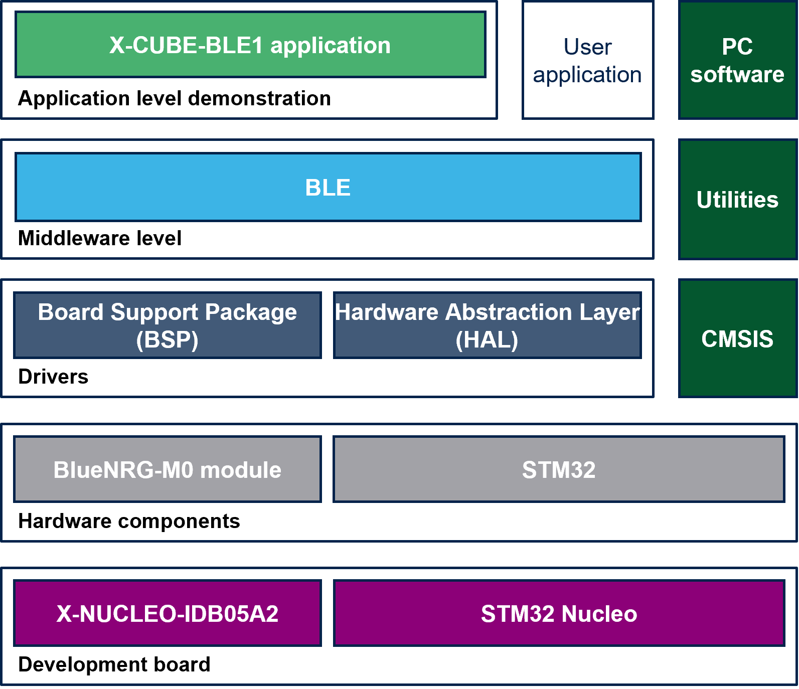

::: {.row}
::: {.col-sm-12 .col-lg-4}

# Release Notes for <mark>X-CUBE-BLE1</mark>
Copyright &copy; 2021 STMicroelectronics\
    
{.logo}

# Purpose

The <mark>X-CUBE-BLE1</mark> is an expansion software package for STM32Cube. This software provides drivers running on STM32 for STM's BlueNRG-M0 Bluetooth Low Energy device. It also includes the software library for BLE Profiles along with many sample applications. This software package is built on top of STM32Cube software technology that ease portability across different STM32 microcontrollers. 

X-CUBE-BLE1 software features:

- Complete middleware to build applications using BlueNRG-M0 network processor, including BLE standard Central and Peripheral profiles.
- Easy portability across different MCU families thanks to STM32Cube.
- Sample applications that the developer can use to start experimenting with the code.
- References to free Android and iOS Apps that can be used along with the sample applications.
- Free, user-friendly license terms.
- Examples implementation available for X-NUCLEO-IDB05A2 STM32 expansion board plugged on top of NUCLEO-L476RG.

The figure below shows the overall architecture.

- At the bottom layer there are the HW components: the STM32 MCU and the BlueNRG-M0 network processor.  
- The drivers abstract low level details of the hardware and allow the middleware software to provide Bluetooth LE features in a hardware independent fashion.
- The applications provide examples of how to use the code.

Related information and documentation:

- [UM1873](https://www.st.com/content/st_com/en/products/embedded-software/mcu-mpu-embedded-software/stm32-embedded-software/stm32cube-expansion-packages/x-cube-BLE1.html): Getting started with the X-CUBE-BLE1 Bluetooth Low Energy software expansion for STM32Cube
- [AN4642](https://www.st.com/content/st_com/en/products/embedded-software/mcu-mpu-embedded-software/stm32-embedded-software/stm32cube-expansion-packages/x-cube-BLE1.html): Overview of the BLE Profiles application for X-CUBE-BLE1, expansion for STM32Cube
- [STM32Cube](http://www.st.com/stm32cube)
- [STM32 Nucleo boards](http://www.st.com/stm32nucleo)
- [STM32 Nucleo expansion boards](http://www.st.com/x-nucleo)

:::

::: {.col-sm-12 .col-lg-8}
# Update History

::: {.collapse}
<input type="checkbox" id="collapse-section28" checked aria-hidden="true">
<label for="collapse-section28" aria-hidden="true">V6.2.2 / 27-Nov-2021</label>

			

## Main Changes

### Product update

  Headline
  ----------------------------------------------------------
  Align to STMicroelectronics.X-CUBE-BLE1.6.2.2.pack for STM32CubeMX (minimum required version V6.3.0)
  Publish code on GitHub

## Contents
The X-CUBE-BLE1 expansion software package comes with a rich set of examples running on STMicroelectronics boards, organized by board and provided with preconfigured projects for the main supported toolchains.

Documentation

  Name                                                        Version                                           Document
  ----------------------------------------------------------- ------------------------------------------------- ------------------------------------------------------------------------------------------------------------------------------------------------
  X-CUBE-BLE1 API Description                                 V6.2.2                                            [CHM](Documentation\X-CUBE-BLE1.chm)
  Getting Started with X-CUBE-BLE1 pack for STM32CubeMX       V6.2.2                                            [PDF](Documentation\STMicroelectronics.X-CUBE-BLE1_GettingStarted.pdf)
  BlueNRG-MS middleware for STM32Cube                         V6.2.2                                            [CHM](Middlewares\ST\BlueNRG-MS\doc\BlueNRG-MS_UserManual.chm)

Drivers

  Name                                                        Version                                           Release note
  ----------------------------------------------------------- ------------------------------------------------- ------------------------------------------------------------------------------------------------------------------------------------------------
  STM32L4xx CMSIS                                             V1.7.1                                            [release notes](Drivers\CMSIS\Device\ST\STM32L4xx\Release_Notes.html)
  STM32L4xx HAL                                               V1.13.0                                           [release notes](Drivers\STM32L4xx_HAL_Driver\Release_Notes.html)
  BSP STM32L4xx_Nucleo                                        V2.1.7                                            [release notes](Drivers\BSP\STM32L4xx_Nucleo\Release_Notes.html)
  BSP X-NUCLEO-IDB0xA1                                        V3.0.1                                            [release notes](Drivers\BSP\X-NUCLEO-IDB0xA1\Release_Notes.html)

Middlewares
  
  Name                                                        Version                                           Release note
  ----------------------------------------------------------- ------------------------------------------------- ------------------------------------------------------------------------------------------------------------------------------------------------
  BlueNRG-MS                                                  V5.1.1                                            [release notes](Middlewares\ST\BlueNRG-MS\Release_Notes.html)
  LowPowerManager                                             V1.0.1                                            [release notes](Middlewares\ST\LowPowerManager\Release_Notes.html)
  TimerServer                                                 V1.1.1                                            [release notes](Middlewares\ST\TimerServer\Release_Notes.html)

Projects
  
  Name                                                        Version                                           Release note
  ----------------------------------------------------------- ------------------------------------------------- ------------------------------------------------------------------------------------------------------------------------------------------------
  Projects                                                    V6.1.2                                            [release notes](Projects\Release_Notes.html)

## Known Limitations
 
- On dual-core STM32 series this expansion software can be used on both cores but exclusively 

## Development Toolchains and Compilers

- IAR Embedded Workbench for ARM (EWARM) toolchain V8.50.9
- RealView Microcontroller Development Kit (MDK-ARM) toolchain V5.32.0 
- STM32CubeIDE V1.7.0

## Supported Devices and Boards

- STM32L476RG devices and STM32L476RG-Nucleo board RevC
- BlueNRG-M0 device and X-NUCLEO-IDB05A2 board
 IMPORTANT: the X-CUBE-BLE1 software package also supports the BlueNRG-MS device and the X-NUCLEO-IDB05A1 expansion board

## Dependencies

None

:::

::: {.collapse}
<input type="checkbox" id="collapse-section27" aria-hidden="true">
<label for="collapse-section27" aria-hidden="true">V6.2.1 / 09-July-2021</label>

			

## Main Changes

### Product update

  Headline
  ----------------------------------------------------------
  Align to STMicroelectronics.X-CUBE-BLE1.6.2.1.pack for STM32CubeMX (minimum required version V6.3.0)
  Fix Beacon sample application for STM32U5 series

## Contents
The X-CUBE-BLE1 expansion software package comes with a rich set of examples running on STMicroelectronics boards, organized by board and provided with preconfigured projects for the main supported toolchains.

Documentation

  Name                                                        Version                                           Document
  ----------------------------------------------------------- ------------------------------------------------- ------------------------------------------------------------------------------------------------------------------------------------------------
  X-CUBE-BLE1 API Description                                 V6.2.1                                            [CHM](Documentation\X-CUBE-BLE1.chm)
  Getting Started with X-CUBE-BLE1 pack for STM32CubeMX       V6.2.1                                            [PDF](Documentation\STMicroelectronics.X-CUBE-BLE1_GettingStarted.pdf)
  BlueNRG-MS middleware for STM32Cube                         V6.2.1                                            [CHM](Middlewares\ST\BlueNRG-MS\doc\BlueNRG-MS_UserManual.chm)

Drivers

  Name                                                        Version                                           Release note
  ----------------------------------------------------------- ------------------------------------------------- ------------------------------------------------------------------------------------------------------------------------------------------------
  STM32F4xx CMSIS                                             V2.6.6                                            [release notes](Drivers\CMSIS\Device\ST\STM32F4xx\Release_Notes.html)
  STM32F4xx HAL                                               V1.7.12                                           [release notes](Drivers\STM32F4xx_HAL_Driver\Release_Notes.html)
  BSP STM32F4xx_Nucleo                                        V1.2.7                                            [release notes](Drivers\BSP\STM32F4xx-Nucleo\Release_Notes.html)
  STM32L0xx CMSIS                                             V1.9.1                                            [release notes](Drivers\CMSIS\Device\ST\STM32L0xx\Release_Notes.html)
  STM32L0xx HAL                                               V1.10.4                                           [release notes](Drivers\STM32L0xx_HAL_Driver\Release_Notes.html)
  BSP STM32L0xx_Nucleo                                        V2.1.3                                            [release notes](Drivers\BSP\STM32L0xx_Nucleo\Release_Notes.html)
  STM32L4xx CMSIS                                             V1.7.1                                            [release notes](Drivers\CMSIS\Device\ST\STM32L4xx\Release_Notes.html)
  STM32L4xx HAL                                               V1.13.0                                           [release notes](Drivers\STM32L4xx_HAL_Driver\Release_Notes.html)
  BSP STM32L4xx_Nucleo                                        V2.1.7                                            [release notes](Drivers\BSP\STM32L4xx_Nucleo\Release_Notes.html)
  BSP X-NUCLEO-IDB0xA1                                        V3.0.0                                            [release notes](Drivers\BSP\X-NUCLEO-IDB0xA1\Release_Notes.html)

Middlewares
  
  Name                                                        Version                                           Release note
  ----------------------------------------------------------- ------------------------------------------------- ------------------------------------------------------------------------------------------------------------------------------------------------
  BlueNRG-MS                                                  V5.1.0                                            [release notes](Middlewares\ST\BlueNRG-MS\Release_Notes.html)
  LowPowerManager                                             V1.0.0                                            [release notes](Middlewares\ST\LowPowerManager\Release_Notes.html)
  TimerServer                                                 V1.1.0                                            [release notes](Middlewares\ST\TimerServer\Release_Notes.html)

Projects
  
  Name                                                        Version                                           Release note
  ----------------------------------------------------------- ------------------------------------------------- ------------------------------------------------------------------------------------------------------------------------------------------------
  Projects                                                    V6.1.1                                            [release notes](Projects\Release_Notes.html)

Utilities

  Name                                                        Version                                           Release note
  ----------------------------------------------------------- ------------------------------------------------- ------------------------------------------------------------------------------------------------------------------------------------------------
  Flash Updater Tool                                          V2.1.0                                            [readme](Utilities\PC_Software\FlashUpdaterTool\flashUpdater.readme)
  Profile Central Tool                                        V3.1.0                                            [readme](Utilities\PC_Software\ProfileCentralTool\readme.txt)

## Known Limitations
 
- On dual-core STM32 series this expansion software can be used on both cores but exclusively 

## Development Toolchains and Compilers

- IAR Embedded Workbench for ARM (EWARM) toolchain V8.50.9
- RealView Microcontroller Development Kit (MDK-ARM) toolchain V5.32.0 
- STM32CubeIDE V1.6.1

## Supported Devices and Boards

- STM32F401RE devices and STM32F401RE-Nucleo board RevC
- STM32L053R8 devices and STM32L053R8-Nucleo board RevC
- STM32L476RG devices and STM32L476RG-Nucleo board RevC
- BlueNRG-M0 device and X-NUCLEO-IDB05A2 board
 IMPORTANT: the X-CUBE-BLE1 software package also supports the BlueNRG-MS device and the X-NUCLEO-IDB05A1 expansion board

## Dependencies

None

:::

::: {.collapse}
<input type="checkbox" id="collapse-section26" aria-hidden="true">
<label for="collapse-section26" aria-hidden="true">V6.2.0 / 05-May-2021</label>

			

## Main Changes

### Product update

  Headline
  ----------------------------------------------------------
  Align to STMicroelectronics.X-CUBE-BLE1.6.2.0.pack for STM32CubeMX (minimum required version V6.2.1)
  Update on STM32Cube HAL drivers
  Add support to Example Selector in STM32CubeMX

## Contents
The X-CUBE-BLE1 expansion software package comes with a rich set of examples running on STMicroelectronics boards, organized by board and provided with preconfigured projects for the main supported toolchains.

Documentation

  Name                                                        Version                                           Document
  ----------------------------------------------------------- ------------------------------------------------- ------------------------------------------------------------------------------------------------------------------------------------------------
  X-CUBE-BLE1 API Description                                 V6.2.0                                            [CHM](Documentation\X-CUBE-BLE1.chm)
  Getting Started with X-CUBE-BLE1 pack for STM32CubeMX       V6.2.0                                            [PDF](Documentation\STMicroelectronics.X-CUBE-BLE1_GettingStarted.pdf)
  BlueNRG-MS middleware for STM32Cube                         V6.2.0                                            [CHM](Middlewares\ST\BlueNRG-MS\doc\BlueNRG-MS_UserManual.chm)

Drivers

  Name                                                        Version                                           Release note
  ----------------------------------------------------------- ------------------------------------------------- ------------------------------------------------------------------------------------------------------------------------------------------------
  STM32F4xx CMSIS                                             V2.6.6                                            [release notes](Drivers\CMSIS\Device\ST\STM32F4xx\Release_Notes.html)
  STM32F4xx HAL                                               V1.7.11                                           [release notes](Drivers\STM32F4xx_HAL_Driver\Release_Notes.html)
  BSP STM32F4xx_Nucleo                                        V1.2.7                                            [release notes](Drivers\BSP\STM32F4xx-Nucleo\Release_Notes.html)
  STM32L0xx CMSIS                                             V1.9.1                                            [release notes](Drivers\CMSIS\Device\ST\STM32L0xx\Release_Notes.html)
  STM32L0xx HAL                                               V1.10.4                                           [release notes](Drivers\STM32L0xx_HAL_Driver\Release_Notes.html)
  BSP STM32L0xx_Nucleo                                        V2.1.3                                            [release notes](Drivers\BSP\STM32L0xx_Nucleo\Release_Notes.html)
  STM32L4xx CMSIS                                             V1.7.1                                            [release notes](Drivers\CMSIS\Device\ST\STM32L4xx\Release_Notes.html)
  STM32L4xx HAL                                               V1.13.0                                           [release notes](Drivers\STM32L4xx_HAL_Driver\Release_Notes.html)
  BSP STM32L4xx_Nucleo                                        V2.1.7                                            [release notes](Drivers\BSP\STM32L4xx_Nucleo\Release_Notes.html)
  BSP X-NUCLEO-IDB0xA1                                        V3.0.0                                            [release notes](Drivers\BSP\X-NUCLEO-IDB0xA1\Release_Notes.html)

Middlewares
  
  Name                                                        Version                                           Release note
  ----------------------------------------------------------- ------------------------------------------------- ------------------------------------------------------------------------------------------------------------------------------------------------
  BlueNRG-MS                                                  V5.1.0                                            [release notes](Middlewares\ST\BlueNRG-MS\Release_Notes.html)
  LowPowerManager                                             V1.0.0                                            [release notes](Middlewares\ST\LowPowerManager\Release_Notes.html)
  TimerServer                                                 V1.1.0                                            [release notes](Middlewares\ST\TimerServer\Release_Notes.html)

Projects
  
  Name                                                        Version                                           Release note
  ----------------------------------------------------------- ------------------------------------------------- ------------------------------------------------------------------------------------------------------------------------------------------------
  Projects                                                    V6.1.0                                            [release notes](Projects\Release_Notes.html)

Utilities

  Name                                                        Version                                           Release note
  ----------------------------------------------------------- ------------------------------------------------- ------------------------------------------------------------------------------------------------------------------------------------------------
  Flash Updater Tool                                          V2.1.0                                            [readme](Utilities\PC_Software\FlashUpdaterTool\flashUpdater.readme)
  Profile Central Tool                                        V3.1.0                                            [readme](Utilities\PC_Software\ProfileCentralTool\readme.txt)

## Known Limitations
 
- On dual-core STM32 series this expansion software can be used on both cores but exclusively 

## Development Toolchains and Compilers

- IAR Embedded Workbench for ARM (EWARM) toolchain V8.50.9
- RealView Microcontroller Development Kit (MDK-ARM) toolchain V5.32.0 
- STM32CubeIDE V1.6.1

## Supported Devices and Boards

- STM32F401RE devices and STM32F401RE-Nucleo board RevC
- STM32L053R8 devices and STM32L053R8-Nucleo board RevC
- STM32L476RG devices and STM32L476RG-Nucleo board RevC
- BlueNRG-M0 device and X-NUCLEO-IDB05A2 board
 IMPORTANT: the X-CUBE-BLE1 software package also supports the BlueNRG-MS device and the X-NUCLEO-IDB05A1 expansion board

## Dependencies

None

:::

::: {.collapse}
<input type="checkbox" id="collapse-section25" aria-hidden="true">
<label for="collapse-section25" aria-hidden="true">V6.1.0 / 03-November-2020</label>

			

## Main Changes

### Product update

  Headline
  ----------------------------------------------------------
  Align to STMicroelectronics.X-CUBE-BLE1.6.1.0.pack for STM32CubeMX (minimum required version V6.1.0)
  Update on STM32Cube HAL drivers
  Other improvements

## Contents
The X-CUBE-BLE1 expansion software package comes with a rich set of examples running on STMicroelectronics boards, organized by board and provided with preconfigured projects for the main supported toolchains.

Documentation

  Name                                                        Version                                           Document
  ----------------------------------------------------------- ------------------------------------------------- ------------------------------------------------------------------------------------------------------------------------------------------------
  X-CUBE-BLE1 API Description                                 V6.1.0                                            [CHM](Documentation\X-CUBE-BLE1.chm)
  Getting Started with X-CUBE-BLE1 pack for STM32CubeMX       V6.1.0                                            [PDF](Documentation\STMicroelectronics.X-CUBE-BLE1_GettingStarted.pdf)
  BlueNRG-MS middleware for STM32Cube                         V6.1.0                                            [CHM](Middlewares\ST\BlueNRG-MS\doc\BlueNRG-MS_UserManual.chm)

Drivers

  Name                                                        Version                                           Release note
  ----------------------------------------------------------- ------------------------------------------------- ------------------------------------------------------------------------------------------------------------------------------------------------
  STM32F4xx CMSIS                                             V2.6.5                                            [release notes](Drivers\CMSIS\Device\ST\STM32F4xx\Release_Notes.html)
  STM32F4xx HAL                                               V1.7.10                                           [release notes](Drivers\STM32F4xx_HAL_Driver\Release_Notes.html)
  BSP STM32F4xx_Nucleo                                        V1.2.7                                            [release notes](Drivers\BSP\STM32F4xx-Nucleo\Release_Notes.html)
  STM32L0xx CMSIS                                             V1.9.1                                            [release notes](Drivers\CMSIS\Device\ST\STM32L0xx\Release_Notes.html)
  STM32L0xx HAL                                               V1.10.4                                           [release notes](Drivers\STM32L0xx_HAL_Driver\Release_Notes.html)
  BSP STM32L0xx_Nucleo                                        V2.1.3                                            [release notes](Drivers\BSP\STM32L0xx_Nucleo\Release_Notes.html)
  STM32L4xx CMSIS                                             V1.7.0                                            [release notes](Drivers\CMSIS\Device\ST\STM32L4xx\Release_Notes.html)
  STM32L4xx HAL                                               V1.12.0                                           [release notes](Drivers\STM32L4xx_HAL_Driver\Release_Notes.html)
  BSP STM32L4xx_Nucleo                                        V2.1.6                                            [release notes](Drivers\BSP\STM32L4xx_Nucleo\Release_Notes.html)
  BSP X-NUCLEO-IDB0xA1                                        V3.0.0                                            [release notes](Drivers\BSP\X-NUCLEO-IDB0xA1\Release_Notes.html)

Middlewares
  
  Name                                                        Version                                           Release note
  ----------------------------------------------------------- ------------------------------------------------- ------------------------------------------------------------------------------------------------------------------------------------------------
  BlueNRG-MS                                                  V5.1.0                                            [release notes](Middlewares\ST\BlueNRG-MS\Release_Notes.html)
  LowPowerManager                                             V1.0.0                                            [release notes](Middlewares\ST\LowPowerManager\Release_Notes.html)
  TimerServer                                                 V1.1.0                                            [release notes](Middlewares\ST\TimerServer\Release_Notes.html)

Projects
  
  Name                                                        Version                                           Release note
  ----------------------------------------------------------- ------------------------------------------------- ------------------------------------------------------------------------------------------------------------------------------------------------
  Projects                                                    V5.1.0                                            [release notes](Projects\Release_Notes.html)

Utilities

  Name                                                        Version                                           Release note
  ----------------------------------------------------------- ------------------------------------------------- ------------------------------------------------------------------------------------------------------------------------------------------------
  Flash Updater Tool                                          V2.1.0                                            [readme](Utilities\PC_Software\FlashUpdaterTool\flashUpdater.readme)
  Profile Central Tool                                        V3.1.0                                            [readme](Utilities\PC_Software\ProfileCentralTool\readme.txt)

## Known Limitations
 
- On dual-core STM32 series this expansion software can be used on both cores but exclusively 

## Development Toolchains and Compilers

- IAR Embedded Workbench for ARM (EWARM) toolchain V8.50.5 + STLink/V2
- RealView Microcontroller Development Kit (MDK-ARM) toolchain V5.31.0 + ST-LINK/V2 
- STM32CubeIDE V1.4.1 + ST-LINK/V2

## Supported Devices and Boards

- STM32F401RE devices and STM32F401RE-Nucleo board RevC
- STM32L053R8 devices and STM32L053R8-Nucleo board RevC
- STM32L476RG devices and STM32L476RG-Nucleo board RevC
- BlueNRG-M0 device and X-NUCLEO-IDB05A2 board
 IMPORTANT: the X-CUBE-BLE1 software package also supports the BlueNRG-MS device and the X-NUCLEO-IDB05A1 expansion board

## Dependencies

None

:::

::: {.collapse}
<input type="checkbox" id="collapse-section24" aria-hidden="true">
<label for="collapse-section24" aria-hidden="true">V6.0.0 / 03-July-2020</label>

			

## Main Changes

### Product update

  Headline
  ----------------------------------------------------------
  Align to STMicroelectronics.X-CUBE-BLE1.6.0.0.pack for STM32CubeMX (minimum required version V6.0.0)
  Update on STM32Cube HAL drivers
  New HCI file inclusion model

## Contents

Documentation

  Name                                                        Version                                           Document
  ----------------------------------------------------------- ------------------------------------------------- ------------------------------------------------------------------------------------------------------------------------------------------------
  X-CUBE-BLE1 API Description                                 V6.0.0                                            [CHM](Documentation\X-CUBE-BLE1.chm)
  Getting Started with X-CUBE-BLE1 pack for STM32CubeMX       V6.0.0                                            [PDF](Documentation\STMicroelectronics.X-CUBE-BLE1_GettingStarted.pdf)
  BlueNRG-MS middleware for STM32Cube                         V6.0.0                                            [CHM](Middlewares\ST\BlueNRG-MS\doc\BlueNRG-MS_UserManual.chm)

Drivers

  Name                                                        Version                                           Release note
  ----------------------------------------------------------- ------------------------------------------------- ------------------------------------------------------------------------------------------------------------------------------------------------
  STM32F4xx CMSIS                                             V2.6.5                                            [release notes](Drivers\CMSIS\Device\ST\STM32F4xx\Release_Notes.html)
  STM32F4xx HAL                                               V1.7.8                                            [release notes](Drivers\STM32F4xx_HAL_Driver\Release_Notes.html)
  BSP STM32F4xx_Nucleo                                        V1.2.7                                            [release notes](Drivers\BSP\STM32F4xx-Nucleo\Release_Notes.html)
  STM32L0xx CMSIS                                             V1.9.0                                            [release notes](Drivers\CMSIS\Device\ST\STM32L0xx\Release_Notes.html)
  STM32L0xx HAL                                               V1.10.0                                           [release notes](Drivers\STM32L0xx_HAL_Driver\Release_Notes.html)
  BSP STM32L0xx_Nucleo                                        V2.1.2                                            [release notes](Drivers\BSP\STM32L0xx_Nucleo\Release_Notes.html)
  STM32L4xx CMSIS                                             V1.7.0                                            [release notes](Drivers\CMSIS\Device\ST\STM32L4xx\Release_Notes.html)
  STM32L4xx HAL                                               V1.12.0                                           [release notes](Drivers\STM32L4xx_HAL_Driver\Release_Notes.html)
  BSP STM32L4xx_Nucleo                                        V2.1.6                                            [release notes](Drivers\BSP\STM32L4xx_Nucleo\Release_Notes.html)
  BSP X-NUCLEO-IDB0xA1                                        V3.0.0                                            [release notes](Drivers\BSP\X-NUCLEO-IDB0xA1\Release_Notes.html)

Middlewares
  
  Name                                                        Version                                           Release note
  ----------------------------------------------------------- ------------------------------------------------- ------------------------------------------------------------------------------------------------------------------------------------------------
  BlueNRG-MS                                                  V5.0.0                                            [release notes](Middlewares\ST\BlueNRG-MS\Release_Notes.html)
  LowPowerManager                                             V1.0.0                                            [release notes](Middlewares\ST\LowPowerManager\Release_Notes.html)
  TimerServer                                                 V1.1.0                                            [release notes](Middlewares\ST\TimerServer\Release_Notes.html)

Projects
  
  Name                                                        Version                                           Release note
  ----------------------------------------------------------- ------------------------------------------------- ------------------------------------------------------------------------------------------------------------------------------------------------
  Projects                                                    V5.0.0                                            [release notes](Projects\Release_Notes.html)

Utilities

  Name                                                        Version                                           Release note
  ----------------------------------------------------------- ------------------------------------------------- ------------------------------------------------------------------------------------------------------------------------------------------------
  Flash Updater Tool                                          V2.1.0                                            [readme](Utilities\PC_Software\FlashUpdaterTool\flashUpdater.readme)
  Profile Central Tool                                        V3.1.0                                            [readme](Utilities\PC_Software\ProfileCentralTool\readme.txt)

## Development Toolchains and Compilers

- IAR Embedded Workbench for ARM (EWARM) toolchain V8.32.3 + STLink/V2
- RealView Microcontroller Development Kit (MDK-ARM) toolchain V5.29.0 + ST-LINK/V2 
- STM32CubeIDE V1.3.1 + ST-LINK/V2

## Supported Devices and Boards

- STM32F401RE devices and STM32F401RE-Nucleo board RevC
- STM32L053R8 devices and STM32L053R8-Nucleo board RevC
- STM32L476RG devices and STM32L476RG-Nucleo board RevC
- BlueNRG-M0 device and X-NUCLEO-IDB05A2 board
 IMPORTANT: the X-CUBE-BLE1 software package also supports the BlueNRG-MS device and the X-NUCLEO-IDB05A1 expansion board

:::

::: {.collapse}
<input type="checkbox" id="collapse-section23" aria-hidden="true">
<label for="collapse-section23" aria-hidden="true">V5.0.1 / 22-May-2020</label>

			

## Main Changes

### Product update

  Headline
  ----------------------------------------------------------
  Add support to X-NUCLEO-IDB05A2 expansion board 
  IMPORTANT: the X-CUBE-BLE1 software package also supports the X-NUCLEO-IDB05A1 expansion board

## Contents

Documentation

  Name                                                        Version                                           Document
  ----------------------------------------------------------- ------------------------------------------------- ------------------------------------------------------------------------------------------------------------------------------------------------
  X-CUBE-BLE1 API Description                                 V5.0.0                                            [CHM](Documentation\X-CUBE-BLE1.chm)
  Getting Started with X-CUBE-BLE1 pack for STM32CubeMX       V5.0.0                                            [PDF](Documentation\STMicroelectronics.X-CUBE-BLE1_GettingStarted.pdf)
  BlueNRG-MS middleware for STM32Cube                         V5.0.0                                            [CHM](Middlewares\ST\BlueNRG-MS\doc\BlueNRG-MS_UserManual.chm)

Drivers

  Name                                                        Version                                           Release note
  ----------------------------------------------------------- ------------------------------------------------- ------------------------------------------------------------------------------------------------------------------------------------------------
  STM32F4xx CMSIS                                             V2.6.3                                            [release notes](Drivers\CMSIS\Device\ST\STM32F4xx\Release_Notes.html)
  STM32F4xx HAL                                               V1.7.7                                            [release notes](Drivers\STM32F4xx_HAL_Driver\Release_Notes.html)
  BSP STM32F4xx_Nucleo                                        V1.2.7                                            [release notes](Drivers\BSP\STM32F4xx-Nucleo\Release_Notes.html)
  STM32L0xx CMSIS                                             V1.9.0                                            [release notes](Drivers\CMSIS\Device\ST\STM32L0xx\Release_Notes.html)
  STM32L0xx HAL                                               V1.10.2                                           [release notes](Drivers\STM32L0xx_HAL_Driver\Release_Notes.html)
  BSP STM32L0xx_Nucleo                                        V2.1.2                                            [release notes](Drivers\BSP\STM32L0xx_Nucleo\Release_Notes.html)
  STM32L4xx CMSIS                                             V1.6.0                                            [release notes](Drivers\CMSIS\Device\ST\STM32L4xx\Release_Notes.html)
  STM32L4xx HAL                                               V1.11.0                                           [release notes](Drivers\STM32L4xx_HAL_Driver\Release_Notes.html)
  BSP STM32L4xx_Nucleo                                        V2.1.6                                            [release notes](Drivers\BSP\STM32L4xx_Nucleo\Release_Notes.html)
  BSP X-NUCLEO-IDB0xA1                                        V3.0.0                                            [release notes](Drivers\BSP\X-NUCLEO-IDB0xA1\Release_Notes.html)

Middlewares
  
  Name                                                        Version                                           Release note
  ----------------------------------------------------------- ------------------------------------------------- ------------------------------------------------------------------------------------------------------------------------------------------------
  BlueNRG-MS                                                  V4.0.0                                            [release notes](Middlewares\ST\BlueNRG-MS\Release_Notes.html)
  LowPowerManager                                             V1.0.0                                            [release notes](Middlewares\ST\LowPowerManager\Release_Notes.html)
  TimerServer                                                 V1.1.0                                            [release notes](Middlewares\ST\TimerServer\Release_Notes.html)

Projects
  
  Name                                                        Version                                           Release note
  ----------------------------------------------------------- ------------------------------------------------- ------------------------------------------------------------------------------------------------------------------------------------------------
  Projects                                                    V3.4.0                                            [release notes](Projects\Release_Notes.html)

Utilities

  Name                                                        Version                                           Release note
  ----------------------------------------------------------- ------------------------------------------------- ------------------------------------------------------------------------------------------------------------------------------------------------
  Flash Updater Tool                                          V2.1.0                                            [readme](Utilities\PC_Software\FlashUpdaterTool\flashUpdater.readme)
  Profile Central Tool                                        V3.1.0                                            [readme](Utilities\PC_Software\ProfileCentralTool\readme.txt)

## Development Toolchains and Compilers

- IAR Embedded Workbench for ARM (EWARM) toolchain V8.32.3 + STLink/V2
- RealView Microcontroller Development Kit (MDK-ARM) toolchain V5.27.1 + ST-LINK/V2 
- STM32CubeIDE V1.2.1 + ST-LINK/V2

## Supported Devices and Boards

- STM32F401RE devices and STM32F401RE-Nucleo board RevC
- STM32L053R8 devices and STM32L053R8-Nucleo board RevC
- STM32L476RG devices and STM32L476RG-Nucleo board RevC
- BlueNRG-M0 module and X-NUCLEO-IDB05A2 expansion board
 IMPORTANT: the X-CUBE-BLE1 software package also supports the BlueNRG-MS device and the X-NUCLEO-IDB05A1 expansion board

:::

::: {.collapse}
<input type="checkbox" id="collapse-section22" aria-hidden="true">
<label for="collapse-section22" aria-hidden="true">V5.0.0 / 07-February-2020</label>

			

## Main Changes

### Product update

  Headline
  ----------------------------------------------------------
  Align to STMicroelectronics.X-CUBE-BLE1.5.0.0.pack for STM32CubeMX (minimum required version V5.6.0)
  Update on STM32Cube HAL drivers
  Introduce support to STM32CubeIDE V1.2.1
  Remove support to SW4STM32

## Contents

Documentation

  Name                                                        Version                                           Document
  ----------------------------------------------------------- ------------------------------------------------- ------------------------------------------------------------------------------------------------------------------------------------------------
  X-CUBE-BLE1 API Description                                 V5.0.0                                            [CHM](Documentation\X-CUBE-BLE1.chm)
  Getting Started with X-CUBE-BLE1 pack for STM32CubeMX       V5.0.0                                            [PDF](Documentation\STMicroelectronics.X-CUBE-BLE1_GettingStarted.pdf)
  BlueNRG-MS middleware for STM32Cube                         V5.0.0                                            [CHM](Middlewares\ST\BlueNRG-MS\doc\BlueNRG-MS_UserManual.chm)

Drivers

  Name                                                        Version                                           Release note
  ----------------------------------------------------------- ------------------------------------------------- ------------------------------------------------------------------------------------------------------------------------------------------------
  STM32F4xx CMSIS                                             V2.6.3                                            [release notes](Drivers\CMSIS\Device\ST\STM32F4xx\Release_Notes.html)
  STM32F4xx HAL                                               V1.7.7                                            [release notes](Drivers\STM32F4xx_HAL_Driver\Release_Notes.html)
  BSP STM32F4xx_Nucleo                                        V1.2.7                                            [release notes](Drivers\BSP\STM32F4xx-Nucleo\Release_Notes.html)
  STM32L0xx CMSIS                                             V1.9.0                                            [release notes](Drivers\CMSIS\Device\ST\STM32L0xx\Release_Notes.html)
  STM32L0xx HAL                                               V1.10.2                                           [release notes](Drivers\STM32L0xx_HAL_Driver\Release_Notes.html)
  BSP STM32L0xx_Nucleo                                        V2.1.2                                            [release notes](Drivers\BSP\STM32L0xx_Nucleo\Release_Notes.html)
  STM32L4xx CMSIS                                             V1.6.0                                            [release notes](Drivers\CMSIS\Device\ST\STM32L4xx\Release_Notes.html)
  STM32L4xx HAL                                               V1.11.0                                           [release notes](Drivers\STM32L4xx_HAL_Driver\Release_Notes.html)
  BSP STM32L4xx_Nucleo                                        V2.1.6                                            [release notes](Drivers\BSP\STM32L4xx_Nucleo\Release_Notes.html)
  BSP X-NUCLEO-IDB0xA1                                        V3.0.0                                            [release notes](Drivers\BSP\X-NUCLEO-IDB0xA1\Release_Notes.html)

Middlewares
  
  Name                                                        Version                                           Release note
  ----------------------------------------------------------- ------------------------------------------------- ------------------------------------------------------------------------------------------------------------------------------------------------
  BlueNRG-MS                                                  V4.0.0                                            [release notes](Middlewares\ST\BlueNRG-MS\Release_Notes.html)
  LowPowerManager                                             V1.0.0                                            [release notes](Middlewares\ST\LowPowerManager\Release_Notes.html)
  TimerServer                                                 V1.1.0                                            [release notes](Middlewares\ST\TimerServer\Release_Notes.html)

Projects
  
  Name                                                        Version                                           Release note
  ----------------------------------------------------------- ------------------------------------------------- ------------------------------------------------------------------------------------------------------------------------------------------------
  Projects                                                    V3.4.0                                            [release notes](Projects\Release_Notes.html)

Utilities

  Name                                                        Version                                           Release note
  ----------------------------------------------------------- ------------------------------------------------- ------------------------------------------------------------------------------------------------------------------------------------------------
  Flash Updater Tool                                          V2.1.0                                            [readme](Utilities\PC_Software\FlashUpdaterTool\flashUpdater.readme)
  Profile Central Tool                                        V3.1.0                                            [readme](Utilities\PC_Software\ProfileCentralTool\readme.txt)

## Development Toolchains and Compilers

- IAR Embedded Workbench for ARM (EWARM) toolchain V8.32.3 + STLink/V2
- RealView Microcontroller Development Kit (MDK-ARM) toolchain V5.27.1 + ST-LINK/V2 
- STM32CubeIDE V1.2.1 + ST-LINK/V2

## Supported Devices and Boards

- STM32F401RE devices and STM32F401RE-Nucleo board RevC
- STM32L053R8 devices and STM32L053R8-Nucleo board RevC
- STM32L476RG devices and STM32L476RG-Nucleo board RevC
- BlueNRG-MS device and X-NUCLEO-IDB05A1 board

:::

::: {.collapse}
<input type="checkbox" id="collapse-section21" aria-hidden="true">
<label for="collapse-section21" aria-hidden="true">V4.4.0 / 15-April-2019</label>

			

## Main Changes

### Product update

  Headline
  ----------------------------------------------------------
  Align to STMicroelectronics.X-CUBE-BLE1.4.4.0.pack for STM32CubeMX (minimum required version V5.2.0)
  Update on STM32Cube HAL and Middleware driver
  Change HAL EXTI management in sample applications

## Contents

 - STM32Cube HAL and Middlewares drivers
   - STM32F4xx drivers aligned to STM32CubeF4 V1.24.1
   - STM32L0xx drivers aligned to STM32CubeL0 V1.11.2
   - STM32L4xx drivers aligned to STM32CubeL4 V1.14.0

 - Documentation
   - HCI Transport Layer and Transport Layer Interface documentation
   - Getting started with the STMicroelectronics X-CUBE-BLE1 software package for STM32CubeMX

 - Drivers
   - BSP X-NUCLEO-IDB0xA1 V3.0.0

 - Middlewares
   - STM32 BlueNRG-MS Library

 - Utilities
   - Flash Updater Tool
   - Profile Central Java application

## Development Toolchains and Compilers

 - IAR Embedded Workbench for ARM (EWARM) toolchain V8.30.1 + ST-LINK/V2
 - RealView Microcontroller Development Kit (MDK-ARM) toolchain V5.26.2 + ST-LINK/V2
 - Ac6 System Workbench for STM32 V2.7.2 + ST-LINK/V2

## Supported Devices and Boards

 - STM32F401RE, STM32F411RE, STM32L053R8 and STM32L476RG devices
 - NUCLEO-F401RE Board RevC
 - NUCLEO-F411RE Board RevC
 - NUCLEO-L053R8 Board RevC
 - NUCLEO-L476RG Board RevC
 - X-NUCLEO-IDB05A1 Board

:::

::: {.collapse}
<input type="checkbox" id="collapse-section20" aria-hidden="true">
<label for="collapse-section20" aria-hidden="true">V4.3.0 / 18-February-2019</label>

			

## Main Changes

### Product update

  Headline
  ----------------------------------------------------------
  Align to STMicroelectronics.X-CUBE-BLE1.4.3.0.pack for STM32CubeMX (minimum required version V5.1.0)
  Update on STM32Cube HAL and Middleware driver
  Use USER BUTTON in EXTI mode in sample applications

## Contents

 - STM32Cube HAL and Middlewares drivers
   - STM32F4xx drivers aligned to STM32CubeF4 V1.24.0
   - STM32L0xx drivers aligned to STM32CubeL0 V1.11.0
   - STM32L4xx drivers aligned to STM32CubeL4 V1.13.0
   
 - Documentation
   - HCI Transport Layer and Transport Layer Interface documentation
   - Getting started with the STMicroelectronics X-CUBE-BLE1 software package for STM32CubeMX
   
 - Drivers
   - BSP X-NUCLEO-IDB0xA1 V3.0.0
   
 - Middlewares
   - STM32 BlueNRG-MS Library
   
 - Utilities
   - Flash Updater Tool
   - Profile Central Java application

## Development Toolchains and Compilers

 - IAR Embedded Workbench for ARM (EWARM) toolchain V8.30.1 + ST-LINK/V2
 - RealView Microcontroller Development Kit (MDK-ARM) toolchain V5.26.0 + ST-LINK/V2
 - Ac6 System Workbench for STM32 V2.7.2 + ST-LINK/V2

## Supported Devices and Boards

 - STM32F401RE, STM32F411RE, STM32L053R8 and STM32L476RG devices
 - NUCLEO-F401RE Board RevC
 - NUCLEO-F411RE Board RevC
 - NUCLEO-L053R8 Board RevC
 - NUCLEO-L476RG Board RevC
 - X-NUCLEO-IDB04A1 Board Rev1
 - X-NUCLEO-IDB05A1 Board

:::

::: {.collapse}
<input type="checkbox" id="collapse-section19" aria-hidden="true">
<label for="collapse-section19" aria-hidden="true">V4.2.0 / 19-November-2018</label>

			

## Main Changes

### Product update

  Headline
  ----------------------------------------------------------
  Align to STMicroelectronics.X-CUBE-BLE1.4.2.0.pack for STM32CubeMX (minimum required version V5.0.0)
  Add SensorDemo_BLESensor-App sample application
  Modify Flash Updater Tool for upgrading firmware on X-NUCLEO-IDB05A1 to v7.3

## Contents

 - STM32Cube HAL and Middlewares drivers
   - STM32F4xx drivers aligned to STM32CubeF4 V1.21.0
   - STM32L0xx drivers aligned to STM32CubeL0 V1.10.0
   - STM32L4xx drivers aligned to STM32CubeL4 V1.11.0

 - Documentation
   - HCI Transport Layer and Transport Layer Interface documentation 
   - Getting started with the STMicroelectronics X-CUBE-BLE1 software package for STM32CubeMX

 - Drivers
   - BSP X-NUCLEO-IDB0xA1 V3.0.0

 - Middlewares
   - STM32 BlueNRG-MS Library

 - Utilities
   - Flash Updater Tool
   - Profile Central Java application

## Development Toolchains and Compilers

 - IAR Embedded Workbench for ARM (EWARM) toolchain V8.20.1 + ST-LINK/V2
 - RealView Microcontroller Development Kit (MDK-ARM) toolchain V5.24.2 + ST-LINK/V2
 - Ac6 System Workbench for STM32 V2.6.0 + ST-LINK/V2

## Supported Devices and Boards

 - STM32F401RE, STM32F411RE, STM32L053R8 and STM32L476RG devices
 - NUCLEO-F401RE Board RevC
 - NUCLEO-F411RE Board RevC
 - NUCLEO-L053R8 Board RevC
 - NUCLEO-L476RG Board RevC
 - X-NUCLEO-IDB04A1 Board Rev1
 - X-NUCLEO-IDB05A1 Board

:::

::: {.collapse}
<input type="checkbox" id="collapse-section18" aria-hidden="true">
<label for="collapse-section18" aria-hidden="true">V4.1.0 / 31-August-2018</label>

			

## Main Changes

### Product update

  Headline
  ----------------------------------------------------------
  Align to STMicroelectronics.X-CUBE-BLE1.1.1.0.pack for STM32CubeMX (minimum required version V4.27.0)
  Include BLE Profiles, Low Power and Throughput Test sample applications for Nucleo-L476RG

## Contents

 - STM32Cube HAL and Middlewares drivers
   - STM32F4xx drivers aligned to STM32CubeF4 V1.21.0
   - STM32L0xx drivers aligned to STM32CubeL0 V1.10.0
   - STM32L4xx drivers aligned to STM32CubeL4 V1.11.0
   
 - Documentation
   - HCI Transport Layer and Transport Layer Interface documentation
   - Getting started with the STMicroelectronics X-CUBE-BLE1 software package for STM32CubeMX
   
 - Drivers
   - BSP X-NUCLEO-IDB0xA1 V3.0.0
   
 - Middlewares
   - STM32 BlueNRG-MS Library
   
 - Utilities
   - Flash Updater Tool
   - Profile Central Java application

## Development Toolchains and Compilers

 - IAR Embedded Workbench for ARM (EWARM) toolchain V7.80.4 + ST-LINK/V2
 - RealView Microcontroller Development Kit (MDK-ARM) toolchain V5.24.2 + ST-LINK/V2
 - Ac6 System Workbench for STM32 V2.4.0 + ST-LINK/V2

## Supported Devices and Boards

 - STM32F401RE, STM32F411RE, STM32L053R8 and STM32L476RG devices
 - NUCLEO-F401RE Board RevC
 - NUCLEO-F411RE Board RevC
 - NUCLEO-L053R8 Board RevC
 - NUCLEO-L476RG Board RevC
 - X-NUCLEO-IDB04A1 Board Rev1
 - X-NUCLEO-IDB05A1 Board

:::

::: {.collapse}
<input type="checkbox" id="collapse-section17" aria-hidden="true">
<label for="collapse-section17" aria-hidden="true">V4.0.0 / 01-June-2018</label>

			

## Main Changes

### Product update

  Headline
  ----------------------------------------------------------
  Align to STMicroelectronics.BlueNRG-MS.1.0.0.pack for STM32CubeMX (minimum required version V4.26.0)
  Include application configuration files for STM32CubeMX
  
## Contents

 - STM32Cube HAL and Middlewares drivers
   - STM32F4xx drivers aligned to STM32CubeF4 V1.21.0
   - STM32L0xx drivers aligned to STM32CubeL0 V1.10.0
   - STM32L4xx drivers aligned to STM32CubeL4 V1.11.0
 - Documentation
   - HCI Transport Layer and Transport Layer Interface documentation
   - Getting started with the STMicroelectronics BlueNRG-MS software package for STM32CubeMX
 - Drivers
   - BSP X-NUCLEO-IDB0xA1 V2.1.1
 - Middlewares
   - STM32 BlueNRG-MS Library
 - Utilities
   - Flash Updater Tool

## Development Toolchains and Compilers

 - IAR Embedded Workbench for ARM (EWARM) toolchain V7.80.4 + ST-LINK/V2
 - RealView Microcontroller Development Kit (MDK-ARM) toolchain V5.24.2 + ST-LINK/V2
 - Ac6 System Workbench for STM32 V2.4.0 + ST-LINK/V2

## Supported Devices and Boards

 - STM32F401RE, STM32F411RE, STM32L053R8 and STM32L476RG devices
 - NUCLEO-F401RE Board RevC
 - NUCLEO-F411RE Board RevC
 - NUCLEO-L053R8 Board RevC
 - NUCLEO-L476RG Board RevC
 - X-NUCLEO-IDB04A1 Board Rev1
 - X-NUCLEO-IDB05A1 Board

:::

::: {.collapse}
<input type="checkbox" id="collapse-section16" aria-hidden="true">
<label for="collapse-section16" aria-hidden="true">V3.3.0 / 16-April-2018</label>

			

## Main Changes

### Product update

  Headline
  ----------------------------------------------------------
  Include BLE Profiles source code
  Update on STM32Cube HAL and Middleware driver

## Contents

 - STM32Cube HAL and Middlewares drivers
   - STM32F4xx drivers aligned to STM32CubeF4 V1.21.0
   - STM32L0xx drivers aligned to STM32CubeL0 V1.10.0
   - STM32L4xx drivers aligned to STM32CubeL4 V1.11.0
 - Documentation
   - Doxygen documentation
 - Drivers
   - BSP X-NUCLEO-IDB0xA1 V2.1.1
 - Middlewares
   - Low Power Manager
   - STM32 BlueNRG/BlueNRG-MS Library
   - Timer Server
   - BLE Profiles Central Library
   - BLE Profiles Peripheral Library
   - BLE ANCS Profile Library
 - Utilities
   - Flash Updater Tool
   - STM32 BLE Profiles app for Android devices 
     __Note:__ STM BLE Profiles app for Android and iOS devices is available on both Google Play Store and Apple Store
   - Profile Central Java application

## Development Toolchains and Compilers

 - IAR Embedded Workbench for ARM (EWARM) toolchain V7.80.4 + ST-LINK/V2
 - RealView Microcontroller Development Kit (MDK-ARM) toolchain V5.24.2 + ST-LINK/V2
 - Ac6 System Workbench for STM32 V2.4.0 + ST-LINK/V2
 
 
## Supported Devices and Boards

 - STM32F401RE, STM32F411RE, STM32L053R8 and STM32L476RG devices
 - NUCLEO-F401RE Board RevC
 - NUCLEO-F411RE Board RevC
 - NUCLEO-L053R8 Board RevC
 - NUCLEO-L476RG Board RevC
 - X-NUCLEO-IDB04A1 Board Rev1
 - X-NUCLEO-IDB05A1 Board

:::

::: {.collapse}
<input type="checkbox" id="collapse-section15" aria-hidden="true">
<label for="collapse-section15" aria-hidden="true">V3.2.0 / 13-October-2017</label>

			

## Main Changes

### Product update

  Headline
  ----------------------------------------------------------
  Change SPI Baud Rate for STM32L476RG-Nucleo to 5.0 MBits/s
  Update on STM32Cube HAL and Middleware driver
  
## Contents

 - STM32Cube HAL and Middlewares drivers
   - STM32F4xx drivers aligned to STM32CubeF4 V1.16.0
   - STM32L0xx drivers aligned to STM32CubeL0 V1.10.0
   - STM32L4xx drivers aligned to STM32CubeL4 V1.9.0
 - Documentation
   - Doxygen documentation
 - Drivers
   - BSP X-NUCLEO-IDB0xA1 V2.1.0
 - Middlewares
   - Low Power Manager 
   - STM32 BlueNRG/BlueNRG-MS Library
   - Timer Server
   - BLE Profiles Central Library
   - BLE Profiles Peripheral Library
   - BLE ANCS Profile Library
 - Utilities
   - Flash Updater Tool
   - STM32 BLE Profiles app for Android devices 
     __Note:__ STM BLE Profiles app for Android and iOS devices is available on both Google Play Store and Apple Store
   - Profile Central Java application

## Development Toolchains and Compilers

 - IAR Embedded Workbench for ARM (EWARM) toolchain V7.80.4 + ST-LINK/V2
 - RealView Microcontroller Development Kit (MDK-ARM) toolchain V5.22 + ST-LINK/V2
 - Ac6 System Workbench for STM32 V1.14.0 + ST-LINK/V2

## Supported Devices and Boards

 - STM32F401RE, STM32F411RE, STM32L053R8 and STM32L476RG devices
 - NUCLEO-F401RE Board RevC
 - NUCLEO-F411RE Board RevC
 - NUCLEO-L053R8 Board RevC
 - NUCLEO-L476RG Board RevC
 - X-NUCLEO-IDB04A1 Board Rev1
 - X-NUCLEO-IDB05A1 Board

:::

::: {.collapse}
<input type="checkbox" id="collapse-section14" aria-hidden="true">
<label for="collapse-section14" aria-hidden="true">V3.1.0 / 17-July-2017</label>

			

## Main Changes

### Product update

  Headline
  ----------------------------------------------------------
  Improve BLE Central Profiles Library
 
## Contents

 - STM32Cube HAL and Middlewares drivers
   - STM32F4xx drivers aligned to STM32CubeF4 V1.15.0
   - STM32L0xx drivers aligned to STM32CubeL0 V1.8.0
   - STM32L4xx drivers aligned to STM32CubeL4 V1.7.0
 - Documentation
   - Doxygen documentation
 - Drivers
   - BSP X-NUCLEO-IDB0xA1 V2.1.0
 - Middlewares
   - Low Power Manager
   - STM32 BlueNRG/BlueNRG-MS Library
   - Timer Server
   - BLE Profiles Central Library
   - BLE Profiles Peripheral Library
   - BLE ANCS Profile Library
 - Utilities
   - Flash Updater Tool
   - STM32 BLE Profiles app for Android devices  
     __Note:__ STM BLE Profiles app for Android and iOS devices is available on both Google Play Store and Apple Store
   - Profile Central Java application

## Development Toolchains and Compilers

 - IAR Embedded Workbench for ARM (EWARM) toolchain V7.80.4 + ST-LINK/V2
 - RealView Microcontroller Development Kit (MDK-ARM) toolchain V5.22 + ST-LINK/V2
 - Ac6 System Workbench for STM32 V1.11.0 + ST-LINK/V2

## Supported Devices and Boards

 - STM32F401RE, STM32F411RE, STM32L053R8 and STM32L476RG devices
 - NUCLEO-F401RE Board RevC
 - NUCLEO-F411RE Board RevC
 - NUCLEO-L053R8 Board RevC
 - NUCLEO-L476RG Board RevC
 - X-NUCLEO-IDB04A1 Board Rev1
 - X-NUCLEO-IDB05A1 Board

:::

::: {.collapse}
<input type="checkbox" id="collapse-section13" aria-hidden="true">
<label for="collapse-section13" aria-hidden="true">V3.0.0 / 10-February-2017</label>

			

## Main Changes

### Product update

  Headline
  ----------------------------------------------------------
  Update on STM32Cube HAL and Middleware driver
  Include BLE Profiles Peripheral application
  Include BLE Profiles Central application
  Include Apple Notification Center Service (ANCS) Profile application

## Contents

 - STM32Cube HAL and Middlewares drivers
   - STM32F4xx drivers aligned to STM32CubeF4 V1.15.0
   - STM32L0xx drivers aligned to STM32CubeL0 V1.8.0
   - STM32L4xx drivers aligned to STM32CubeL4 V1.7.0
 - Documentation
   - Doxygen documentation
 - Drivers
   - BSP X-NUCLEO-IDB0xA1 V2.0.0
 - Middlewares
   - Low Power Manager
   - STM32 BlueNRG/BlueNRG-MS Library
   - Timer Server
   - BLE Profiles Central Library
   - BLE Profiles Peripheral Library
   - BLE ANCS Profile Library
 - Utilities
   - Flash Updater Tool
   - STM32 BLE Profiles app for Android devices  
     __Note:__ STM BLE Profiles app for Android and iOS devices is available on both Google Play Store and Apple Store
   - Profile Central Java application

## Development Toolchains and Compilers

 - IAR Embedded Workbench for ARM (EWARM) toolchain V7.50.3 + ST-LINK/V2
 - RealView Microcontroller Development Kit (MDK-ARM) toolchain V5.22 + ST-LINK/V2
 - Ac6 System Workbench for STM32 V1.11.0 + ST-LINK/V2

## Supported Devices and Boards

 - STM32F401RE, STM32F411RE, STM32L053R8 and STM32L476RG devices
 - NUCLEO-F401RE Board RevC
 - NUCLEO-F411RE Board RevC
 - NUCLEO-L053R8 Board RevC
 - NUCLEO-L476RG Board RevC
 - X-NUCLEO-IDB04A1 Board Rev1
 - X-NUCLEO-IDB05A1 Board

:::

::: {.collapse}
<input type="checkbox" id="collapse-section12" aria-hidden="true">
<label for="collapse-section12" aria-hidden="true">V2.8.0 / 23-December-2016</label>

			

## Main Changes

### Product update

  Headline
  ----------------------------------------------------------
  Use BlueNRG/BlueNRG-MS HCI middleware from STSW-BLUENRG-DK 2.0.2
  Modify Flash Updater Tool for upgrading firmware on X-NUCLEO-IDB05A1 to v7.2c
  
## Contents

 - STM32Cube HAL and Middlewares drivers
   - STM32F4xx drivers aligned to STM32CubeF4 V1.13.1
   - STM32L0xx drivers aligned to STM32CubeL0 V1.7.0
   - STM32L4xx drivers aligned to STM32CubeL4 V1.5.1
 - Documentation
   - Doxygen documentation
 - Drivers
   - BSP X-NUCLEO-IDB0xA1 V2.0.0
 - Middlewares
   - Low Power Manager 
   - STM32 BlueNRG/BlueNRG-MS Library
   - Timer Server
 - Utilities
   - Flash Updater Tool

## Development Toolchains and Compilers

 - IAR Embedded Workbench for ARM (EWARM) toolchain V7.50.3 + ST-LINK/V2
 - RealView Microcontroller Development Kit (MDK-ARM) toolchain V5.22 + ST-LINK/V2
 - Ac6 System Workbench for STM32 V1.12.0 + ST-LINK/V2

## Supported Devices and Boards

 - STM32F401RE, STM32F411RE, STM32L053R8 and STM32L476RG devices
 - NUCLEO-F401RE Board RevC
 - NUCLEO-F411RE Board RevC
 - NUCLEO-L053R8 Board RevC
 - NUCLEO-L476RG Board RevC
 - X-NUCLEO-IDB04A1 Board Rev1
 - X-NUCLEO-IDB05A1 Board

:::

::: {.collapse}
<input type="checkbox" id="collapse-section11" aria-hidden="true">
<label for="collapse-section11" aria-hidden="true">V2.7.0 / 22-July-2016</label>

			

## Main Changes

### Product update

  Headline
  ----------------------------------------------------------
  Add Eddystone Beacon sample application
  Use BlueNRG HCI middleware from STSW-BLUENRG-DK 2.0.1
  Modify Flash Updater Tool for upgrading firmware on X-NUCLEO-IDB05A1 to v7.2a

## Contents

 - STM32Cube HAL and Middlewares drivers
   - STM32F4xx drivers aligned to STM32CubeF4 V1.12.0
   - STM32L0xx drivers aligned to STM32CubeL0 V1.5.0
   - STM32L4xx drivers aligned to STM32CubeL4 V1.3.0
 - Documentation
   - Doxygen documentation
 - Drivers
   - BSP X-NUCLEO-IDB04A1 V1.3.0
 - Middlewares
   - Low Power Manager
   - STM32 BlueNRG Library
   - Timer Server
 - Utilities
   - Flash Updater Tool

## Development Toolchains and Compilers

 - IAR Embedded Workbench for ARM (EWARM) toolchain V7.50.3 + ST-LINK/V2
 - RealView Microcontroller Development Kit (MDK-ARM) toolchain V5.18a + ST-LINK/V2
 - Ac6 System Workbench for STM32 V1.8.0 + ST-LINK/V2

## Supported Devices and Boards

 - STM32F401RE, STM32F411RE, STM32L053R8 and STM32L476RG devices
 - NUCLEO-F401RE Board RevC
 - NUCLEO-F411RE Board RevC
 - NUCLEO-L053R8 Board RevC
 - NUCLEO-L476RG Board RevC
 - X-NUCLEO-IDB04A1 Board Rev1
 - X-NUCLEO-IDB05A1 Board

:::

::: {.collapse}
<input type="checkbox" id="collapse-section10" aria-hidden="true">
<label for="collapse-section10" aria-hidden="true">V2.6.1 / 01-June-2016</label>

			

## Main Changes

### Product update

  Headline
  ----------------------------------------------------------
  Fix Virtual_COM_Port binary file for Nucleo-F401RE

## Contents

 - STM32Cube HAL and Middlewares drivers
   - STM32F4xx drivers aligned to STM32CubeF4 V1.12.0
   - STM32L0xx drivers aligned to STM32CubeL0 V1.5.0
   - STM32L4xx drivers aligned to STM32CubeL4 V1.3.0
 - Documentation
   - Doxygen documentation
 - Drivers
   - BSP X-NUCLEO-IDB04A1 V1.2.0
 - Middlewares
   - Low Power Manager
   - STM32 BlueNRG Library
   - Timer Server
 - Utilities
   - Flash Updater Tool

## Development Toolchains and Compilers

 - IAR Embedded Workbench for ARM (EWARM) toolchain V7.50.3 + ST-LINK/V2
 - RealView Microcontroller Development Kit (MDK-ARM) toolchain V5.18a + ST-LINK/V2
 - Ac6 System Workbench for STM32 V1.8.0 + ST-LINK/V2

## Supported Devices and Boards

 - STM32F401RE, STM32F411RE, STM32L053R8 and STM32L476RG devices
 - NUCLEO-F401RE Board RevC
 - NUCLEO-F411RE Board RevC
 - NUCLEO-L053R8 Board RevC
 - NUCLEO-L476RG Board RevC
 - X-NUCLEO-IDB04A1 Board Rev1
 - X-NUCLEO-IDB05A1 Board

:::

::: {.collapse}
<input type="checkbox" id="collapse-section9" aria-hidden="true">
<label for="collapse-section9" aria-hidden="true">V2.6.0 / 20-May-2016</label>

			

## Main Changes

### Product update

  Headline
  ----------------------------------------------------------
  Update on STM32Cube HAL and Middleware driver
  Rename file clock.h to ble_clock.h
  Rename file list.h to ble_list.h
  Rename file list.c to ble_list.c

## Contents

 - STM32Cube HAL and Middlewares drivers
   - STM32F4xx drivers aligned to STM32CubeF4 V1.12.0
   - STM32L0xx drivers aligned to STM32CubeL0 V1.5.0
   - STM32L4xx drivers aligned to STM32CubeL4 V1.3.0
 - Documentation
   - Doxygen documentation
 - Drivers
   - BSP X-NUCLEO-IDB04A1 V1.2.0 
 - Middlewares
   - Low Power Manager 
   - STM32 BlueNRG Library 
   - Timer Server 
 - Utilities
   - Flash Updater Tool

## Development Toolchains and Compilers

 - IAR Embedded Workbench for ARM (EWARM) toolchain V7.50.3 + ST-LINK/V2
 - RealView Microcontroller Development Kit (MDK-ARM) toolchain V5.18a + ST-LINK/V2
 - Ac6 System Workbench for STM32 V1.8.0 + ST-LINK/V2

## Supported Devices and Boards

 - STM32F401RE, STM32F411RE, STM32L053R8 and STM32L476RG devices
 - NUCLEO-F401RE Board RevC
 - NUCLEO-F411RE Board RevC
 - NUCLEO-L053R8 Board RevC
 - NUCLEO-L476RG Board RevC
 - X-NUCLEO-IDB04A1 Board Rev1
 - X-NUCLEO-IDB05A1 Board

:::

::: {.collapse}
<input type="checkbox" id="collapse-section8" aria-hidden="true">
<label for="collapse-section8" aria-hidden="true">V2.5.2 / 18-December-2015</label>

			

## Main Changes

### Product update

  Headline
  ----------------------------------------------------------
  Modify Flash Updater Tool for upgrading firmware on X-NUCLEO-IDB05A1 to v7.1e

## Contents

 - STM32Cube HAL and Middlewares drivers
   - STM32F4xx drivers aligned to STM32CubeF4 V1.8.0
   - STM32L0xx drivers aligned to STM32CubeL0 V1.3.0
   - STM32L4xx drivers aligned to STM32CubeL4 V1.1.0
 - Documentation
   - Doxygen documentation 
 - Drivers
   - BSP X-NUCLEO-IDB04A1 V1.1.0 
 - Middlewares
   - Low Power Manager 
   - STM32 BlueNRG Library 
   - Timer Server 
 - Utilities
   - Flash Updater Tool

## Development Toolchains and Compilers

 - IAR Embedded Workbench for ARM (EWARM) toolchain V7.40 + ST-LINK/V2
 - RealView Microcontroller Development Kit (MDK-ARM) toolchain V5.14 + ST-LINK/V2
 - Ac6 System Workbench for STM32 V1.4.0 + ST-LINK/V2

## Supported Devices and Boards

 - STM32F401RE, STM32F411RE, STM32L053R8 and STM32L476RG devices
 - NUCLEO-F401RE Board RevC
 - NUCLEO-F411RE Board RevC
 - NUCLEO-L053R8 Board RevC
 - NUCLEO-L476RG Board RevC
 - X-NUCLEO-IDB04A1 Board Rev1
 - X-NUCLEO-IDB05A1 Board

:::

::: {.collapse}
<input type="checkbox" id="collapse-section7" aria-hidden="true">
<label for="collapse-section7" aria-hidden="true">V2.5.1 / 30-October-2015</label>

			

## Main Changes

### Product update

  Headline
  ----------------------------------------------------------
  Update on STM32Cube HAL and Middleware driver

## Contents

 - STM32Cube HAL and Middlewares drivers
   - STM32F4xx drivers aligned to STM32CubeF4 V1.8.0
   - STM32L0xx drivers aligned to STM32CubeL0 V1.3.0
   - STM32L4xx drivers aligned to STM32CubeL4 V1.1.0
 - Documentation
   - Doxygen documentation 
 - Drivers
   - BSP X-NUCLEO-IDB04A1 V1.1.0 
 - Middlewares
   - Low Power Manager 
   - STM32 BlueNRG Library 
   - Timer Server 
 - Utilities
   - Flash Updater Tool 

## Development Toolchains and Compilers

 - IAR Embedded Workbench for ARM (EWARM) toolchain V7.40 + ST-LINK/V2
 - RealView Microcontroller Development Kit (MDK-ARM) toolchain V5.14 + ST-LINK/V2
 - Ac6 System Workbench for STM32 V1.4.0 + ST-LINK/V2

## Supported Devices and Boards

 - STM32F401RE, STM32F411RE, STM32L053R8 and STM32L476RG devices
 - NUCLEO-F401RE Board RevC
 - NUCLEO-F411RE Board RevC
 - NUCLEO-L053R8 Board RevC
 - NUCLEO-L476RG Board RevC
 - X-NUCLEO-IDB04A1 Board Rev1
 - X-NUCLEO-IDB05A1 Board

:::

::: {.collapse}
<input type="checkbox" id="collapse-section6" aria-hidden="true">
<label for="collapse-section6" aria-hidden="true">V2.5.0 / 09-October-2015</label>

			

## Main Changes

### Product update

  Headline
  ----------------------------------------------------------
  Update on STM32Cube HAL and Middleware driver
  Use BlueNRG HCI middleware from STSW-BLUENRG-DK 1.8.0
  Introduce detection of BlueNRG expansion board (X-NUCLEO-IDB04A1 or X-NUCLEO-IDB05A1) at runtime
  Introduce support to NUCLEO-L476RG
  Add bandwidth test to SampleApp application
  Add DMA low power optimization to SensorDemo
  Add Java tool to update X-NUCLEO-IDB05A1 firmware

## Contents

 - STM32Cube HAL and Middlewares drivers
STM32F4xx drivers aligned to STM32CubeF4 V1.8.0
STM32L0xx drivers aligned to STM32CubeL0 V1.1.0
STM32L4xx drivers aligned to STM32CubeL4 V1.1.0
 - Documentation
Doxygen documentation 
 - Drivers
BSP X-NUCLEO-IDB04A1 V1.1.0 
 - Middlewares
Low Power Manager 
STM32 BlueNRG Library 
Timer Server 
 - Utilities
Flash Updater Tool

## Development Toolchains and Compilers

 - IAR Embedded Workbench for ARM (EWARM) toolchain V7.40 + ST-LINK/V2
 - RealView Microcontroller Development Kit (MDK-ARM) toolchain V5.14 + ST-LINK/V2
 - Ac6 System Workbench for STM32 V1.4.0 + ST-LINK/V2

## Supported Devices and Boards

 - STM32F401RE, STM32F411RE, STM32L053R8 and STM32L476RG devices
 - NUCLEO-F401RE Board RevC
 - NUCLEO-F411RE Board RevC
 - NUCLEO-L053R8 Board RevC
 - NUCLEO-L476RG Board RevC
 - X-NUCLEO-IDB04A1 Board Rev1
 - X-NUCLEO-IDB05A1 Board

:::

::: {.collapse}
<input type="checkbox" id="collapse-section5" aria-hidden="true">
<label for="collapse-section5" aria-hidden="true">V2.4.0 / 27-May-2015</label>

			

## Main Changes

### Product update

  Headline
  ----------------------------------------------------------
  Update STM32F4xx HAL Drivers to v1.5.0
  Update BlueNRG HCI stack to DK v1.7.0
  Introduce support to BlueNRG-MS (X-NUCLEO-IDB05A1 expansion board)
  Introduce support to Ac6 System Workbench for STM32

## Contents

 - Documentation
   - Doxygen documentation 
 - Drivers
   - Cortex-M CMSIS V4.2
   - STM32F4xx CMSIS V2.3.0 
   - STM32L0xx CMSIS V1.1.0 
   - STM32F4xx HAL V1.3.0 
   - STM32L0xx HAL V1.1.0 
   - BSP STM32F4xx-NUCLEO V1.2.1 
   - BSP STM32L0xx_NUCLEO V1.0.0 
   - BSP X-NUCLEO-IDB04A1 V1.0.0 
 - Middlewares
   - Low Power Manager 
   - STM32 BlueNRG Library 
   - Timer Server 
 - Utilities
   - Flash Updater Tool

## Development Toolchains and Compilers

 - IAR Embedded Workbench for ARM (EWARM) toolchain V7.20 + ST-LINK/V2
 - RealView Microcontroller Development Kit (MDK-ARM) toolchain V5.14 + ST-LINK/V2
 - Ac6 System Workbench for STM32 V1.0.0 + ST-LINK/V2

## Supported Devices and Boards

 - STM32F401RE and STM32L053R8 devices
 - NUCLEO-F401RE Board RevC
 - NUCLEO-F411RE Board RevC
 - NUCLEO-L053R8 Board RevC
 - X-NUCLEO-IDB04A1 Board Rev1
 - X-NUCLEO-IDB05A1 Board

:::

::: {.collapse}
<input type="checkbox" id="collapse-section4" aria-hidden="true">
<label for="collapse-section4" aria-hidden="true">V2.3.0 / 06-March-2015</label>

			

## Main Changes

### Product update

  Headline
  ----------------------------------------------------------
  Add Timer Server in Middlewares
  Add sample application using, along with the DMA module, the STM32 Cube Low Level APIs for setting low power modes
  Add Java based graphical tool for updating the BlueNRG firmware on the X-NUCLEO-IDB04A1 board connected with an STM32 Nucleo board

## Contents

 - Documentation
   - Doxygen documentation
 - Drivers
   - Cortex-M CMSIS V3.20
   - STM32F4xx CMSIS V2.1.0
   - STM32L0xx CMSIS V1.1.0
   - STM32F4xx HAL V1.1.0
   - STM32L0xx HAL V1.1.0
   - BSP STM32F4xx-NUCLEO V1.0.0
   - BSP STM32L0xx_NUCLEO V1.0.0
   - BSP X-NUCLEO-IDB04A1 V1.0.0 (release notes)
 - Middlewares
   - Low Power Manager 
   - STM32 BlueNRG Library
   - Timer Server 
 - Utilities
   - Flash Updater Tool

## Development Toolchains and Compilers

 - IAR Embedded Workbench for ARM (EWARM) toolchain V7.20 + ST-LINK/V2
 - RealView Microcontroller Development Kit (MDK-ARM) toolchain V5.10 + ST-LINK/V2
 - Atollic TrueSTUDIO® for ARM® Pro V5.1.1 + ST-LINK/V2

## Supported Devices and Boards

 - STM32F401RE and STM32L053R8 devices
 - NUCLEO-F401RE Board RevC
 - NUCLEO-L053R8 Board RevC
 - X-NUCLEO-IDB04A1 Board Rev1

:::

::: {.collapse}
<input type="checkbox" id="collapse-section3" aria-hidden="true">
<label for="collapse-section3" aria-hidden="true">V2.2.0 / 05-December-2014</label>

			

## Main Changes

### Product update

  Headline
  ----------------------------------------------------------
  Add support to STM32F401RE-NUCLEO board

## Contents

 - Drivers
   - Cortex-M CMSIS V3.20
   - STM32F4xx CMSIS V2.1.0
   - STM32L0xx CMSIS V1.1.0
   - STM32F4xx HAL V1.1.0 
   - STM32L0xx HAL V1.1.0 
   - BSP STM32F4xx-NUCLEO V1.0.0
   - BSP STM32L0xx_NUCLEO V1.0.0
   - BSP X-NUCLEO-IDB04A1 V1.0.0
 - Middlewares
   - STM32 BlueNRG Library 

:::

::: {.collapse}
<input type="checkbox" id="collapse-section2" aria-hidden="true">
<label for="collapse-section2" aria-hidden="true">V2.1.0 / 19-November-2014</label>

			

## Main Changes

### Product update

  Headline
  ----------------------------------------------------------
  Add Virtual COM sample application
  
## Contents

 - Drivers
   - Cortex-M CMSIS V3.20
   - STM32L0xx CMSIS V1.1.0 
   - STM32L0xx HAL V1.1.0 
   - BSP STM32L0xx_NUCLEO V1.0.0 
   - BSP X-NUCLEO-IDB04A1 V1.0.0 
 - Middlewares
   - STM32 BlueNRG Library

:::

::: {.collapse}
<input type="checkbox" id="collapse-section1" aria-hidden="true">
<label for="collapse-section1" aria-hidden="true">V1.0.0 / 10-September-2014</label>

			

## Main Changes

### First release

## 

:::

:::
:::

<footer class="sticky">
::: {.columns}
::: {.column width="95%"}
For complete documentation on **X-CUBE-BLE1**,
visit: [www.st.com](https://my.st.com/content/my_st_com/en/products/embedded-software/mcu-mpu-embedded-software/stm32-embedded-software/stm32cube-expansion-packages/x-cube-BLE1.html)
:::
::: {.column width="5%"}
<abbr title="Based on template cx566953 version 2.0">Info</abbr>
:::
:::
</footer>
